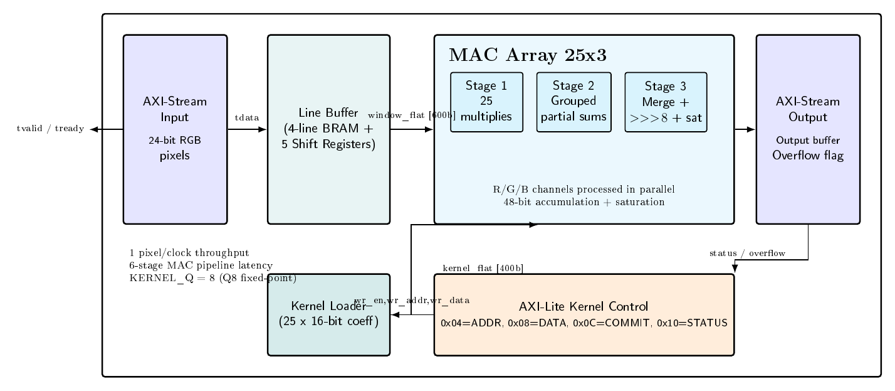

# RGB 5x5 Convolution FPGA Core

Lõi này là một IP xử lý ảnh RGB dạng streaming, nhận 1 pixel 24-bit mỗi chu kỳ, tạo cửa sổ 5x5 bằng line buffer, nhân-chập song song trên 3 kênh màu, chuẩn hóa Q8 và kẹp kết quả về `[0,255]`. Mục tiêu chính của project là chứng minh một lõi convolution nhỏ, rõ kiến trúc, timing-clean, có thể dùng cho camera frame, ảnh spectrogram hoặc các pipeline image-preprocessing trước classifier.



## Điểm Mạnh

- **Streaming thật sự:** dữ liệu đi theo raster scan, 1 pixel/clock sau khi pipeline và cửa sổ 5x5 đã warm-up.
- **Xử lý RGB song song:** R, G, B được nhân-chập cùng lúc, không cần chạy 3 lần theo từng kênh.
- **Pipeline sâu 6 stage:** mảng MAC được chia tầng rõ ràng để rút ngắn critical path.
- **Kernel động:** hệ số 25 tap, signed 16-bit, có thể nạp bằng `kernel_wr_*`, AXI-Lite control hoặc UART parser.
- **Fixed-point gọn:** hệ số Q8, normalize bằng dịch phải số học 8 bit, không cần floating-point.
- **Saturation an toàn:** giá trị âm hoặc tràn được clamp về `[0,255]`, tránh wrap-around gây nhiễu.
- **Full-HD đã kiểm chứng bằng frame thật:** đã chạy 1 frame D455 lên feed `1920x1080`, xuất PNG/HEX và so bit với golden model.
- **Timing headroom tốt:** trên Artix-7 `xc7a100tcsg324-1`, lõi `top_convolution` pass post-route ở `146 MHz`; `147 MHz` fail nhẹ.
- **Tài nguyên LUT thấp:** khoảng `3.99%` LUT trên Arty A7 100T class device.
- **Dễ ghép pipeline khác:** có thể nhận ảnh HEX từ camera hoặc spectrogram ECG nếu dữ liệu được pack thành RGB pixel stream.

## Thông Số Hiện Có

| Hạng mục | Giá trị hiện tại |
| :--- | :--- |
| RTL top của lõi | `src/top_convolution.sv` |
| Board/demo top | `src/arty_top.sv` |
| Target đã synth/route | `xc7a100tcsg324-1` |
| Tool | Vivado 2023.2 |
| Pixel format | RGB 24-bit |
| Kernel | 5x5, 25 tap |
| Coefficient | signed 16-bit |
| Normalize | Q8, arithmetic shift right 8 |
| Output clamp | unsigned 8-bit/channel, `[0,255]` |
| Throughput | 1 pixel/clock sau warm-up |
| MAC latency | 6 cycles trong `mac_array_25x3` |
| Output valid region | từ `(x>=4, y>=4)`; biên trên/trái không có output valid |
| Full-HD input frame | `1920x1080 = 2,073,600` pixels |
| Full-HD valid output | `(1920-4)*(1080-4) = 2,061,616` pixels |
| Theoretical throughput @146 MHz | `146 Mpixel/s`, khoảng `70.4 FPS` cho 1080p input stream |
| Theoretical throughput @100 MHz | `100 Mpixel/s`, khoảng `48.2 FPS` cho 1080p input stream |

## Fmax Và Timing

Kết quả Fmax được đo bằng `scripts/run_fmax_sweep.tcl`, synth/route project-mode cho `top_convolution`, `IMAGE_WIDTH=1920`, target `xc7a100tcsg324-1`.

| Clock | Period | Status | WNS | WHS | Fmax ước lượng |
| :--- | ---: | :---: | ---: | ---: | ---: |
| 150 MHz | 6.666667 ns | FAIL | -0.246 ns | +0.079 ns | 144.66 MHz |
| 147 MHz | 6.802721 ns | FAIL | -0.054 ns | +0.098 ns | 145.84 MHz |
| 146 MHz | 6.849315 ns | PASS | +0.041 ns | +0.057 ns | 146.88 MHz |
| 145 MHz | 6.896552 ns | PASS | +0.049 ns | +0.035 ns | 146.04 MHz |
| 140 MHz | 7.142857 ns | PASS | +0.024 ns | +0.081 ns | 140.47 MHz |

Kết luận timing hiện tại: **mốc an toàn đã route là 146 MHz**. Mốc 147 MHz fail rất nhẹ, nên Fmax thực tế quanh `146 MHz` với flow hiện tại.

Các report chính:

- `vivado_project/fmax_sweep_refine2/fmax_sweep_summary.csv`
- `vivado_project/fmax_sweep_refine2/146MHz/timing_post_route.rpt`
- `vivado_project/fmax_sweep_refine2/146MHz/util_post_route.rpt`

## Tài Nguyên

Post-route utilization ở mốc 146 MHz, `top_convolution`, `IMAGE_WIDTH=1920`, `xc7a100tcsg324-1`:

| Resource | Used | Available | Utilization |
| :--- | ---: | ---: | ---: |
| Slice LUTs | 2,528 | 63,400 | 3.99% |
| LUT as Logic | 368 | 63,400 | 0.58% |
| LUT as Distributed RAM | 2,160 | 19,000 | 11.37% |
| Slice Registers | 521 | 126,800 | 0.41% |
| Block RAM Tile | 1.5 | 135 | 1.11% |
| RAMB36E1 | 1 | 135 | 0.74% |
| RAMB18E1 | 1 | 270 | 0.37% |
| DSPs | 96 | 240 | 40.00% |
| BUFG | 1 | 32 | 3.13% |

Ghi chú: thuật toán có 75 phép nhân song song cho RGB (`25 taps x 3 channels`), nhưng Vivado mapping dùng 96 DSP do cách hấp thụ register/adder vào DSP chain.

## Công Suất

Report power hiện có trong `vivado_project/reports/power_post_route.rpt` cho `top_convolution`:

| Hạng mục | Giá trị |
| :--- | ---: |
| Total On-Chip Power | 0.138 W |
| Dynamic Power | 0.047 W |
| Device Static Power | 0.091 W |
| Junction Temperature | 25.6 C |
| Confidence Level | Medium |

Lưu ý: report power hiện tại có activity coverage thấp (`Design Nets Matched: 1%`), nên dùng tốt cho báo cáo định hướng, chưa nên xem là power signoff cuối.

## Đường Đi Kiến Trúc Của Lõi

Đường dữ liệu chính trong `top_convolution`:

```text
RGB pixel stream
  -> line_buffer_4
       - lưu 4 dòng trước đó
       - tạo 5 hàng pixel cùng tọa độ x
       - shift-register ngang tạo cửa sổ 5x5
  -> mac_array_25x3
       - Stage 1: 25 multiply/channel
       - Stage 2: 8 sub-group partial sums
       - Stage 3: gộp 8 nhóm thành 4 nhóm
       - Stage 4: gộp 4 nhóm thành 2 nửa Lo/Hi
       - Stage 5: cộng cuối và normalize Q8
       - Stage 6: saturation và pack RGB
  -> output RGB pixel stream
```

Đường cấu hình kernel:

```text
Host/Control
  -> kernel_wr_en, kernel_wr_addr, kernel_wr_data
  -> kernel_loader
  -> 25 hệ số signed 16-bit
  -> mac_array_25x3
```

Đường board/UART demo trong `arty_top`:

```text
PC
  -> UART RX
  -> uart_frame_parser
       - lệnh K: nạp 25 hệ số kernel
       - lệnh D: stream RGB pixel
       - lệnh R: reset frame/line buffer
  -> axi_stream_conv_wrapper
  -> top_convolution
  -> uart_frame_packer
  -> UART TX
  -> PC
```

Đường kiểm chứng ảnh D455:

```text
Intel RealSense D455 RGB
  -> Python capture
  -> resize/feed 1920x1080
  -> HEX RRGGBB
  -> RTL simulation
  -> output HEX/PNG
  -> Python golden model compare
```

## Module Chính

| File | Vai trò |
| :--- | :--- |
| `src/top_convolution.sv` | Top của lõi convolution |
| `src/line_buffer_4.sv` | 4 line buffers và 5x5 window generator |
| `src/kernel_loader.sv` | Lưu 25 hệ số kernel signed 16-bit |
| `src/mac_array_25x3.sv` | Mảng MAC RGB 25 tap, pipeline 6 stage |
| `src/axi_stream_conv_wrapper.sv` | Wrapper AXI-Stream input/output |
| `src/axi_lite_kernel_ctrl.sv` | AXI-Lite control cho kernel write/status |
| `src/arty_top.sv` | Demo top cho Arty A7 UART streaming |
| `src/uart_frame_parser.sv` | Parser byte UART thành kernel/pixel stream |
| `src/uart_frame_packer.sv` | Packer output pixel thành byte UART |
| `tb/tb_convolution.sv` | Testbench regression kernel nhỏ |
| `tb/tb_fullhd_frame.sv` | Testbench frame Full-HD không dump waveform |

## Kernel Đang Hỗ Trợ

| Kernel | Tổng hệ số | Ý nghĩa thực tế | Ghi chú |
| :--- | ---: | :--- | :--- |
| `identity5` | 256 | Giữ ảnh gốc ở vùng valid | Dùng để sanity check |
| `gaussian5` | 256 | Blur/làm mượt nhẹ | Hiệu ứng nhẹ trên frame tối |
| `sharpen5` | 0 | High-pass/edge-like | Tên dễ gây hiểu nhầm, output rất tối |
| `emboss5` | 160 | Hiệu ứng nổi/relief | Output tối hơn input vì sum < 256 |
| `laplacian5` | 0 | Edge detector | Output gần đen nếu không auto-contrast |

Lưu ý quan trọng: `sharpen5` hiện không phải true-sharpen giữ nền ảnh. Nếu cần ảnh sharpen đẹp để trình bày, nên thêm kernel có tổng hệ số 256.

## Kết Quả Kiểm Chứng Ảnh Thật

Frame được capture từ Intel RealSense D455 ở `1280x720`, resize thành feed `1920x1080`, rồi chạy qua RTL simulation. D455 trên máy đang expose RGB tối đa `1280x720/1280x800`, nên output Full-HD là feed resized trước khi vào core.

| Kernel | RTL TB | Golden compare | Valid samples | Output |
| :--- | :---: | :---: | ---: | :--- |
| `gaussian5` | PASS | PASS, 0 mismatch | 2,061,616 | `captures/d455/fullhd_rtl_frame/gaussian5/processed/frame_000000.png` |
| `identity5` | PASS | PASS, 0 mismatch | 2,061,616 | `captures/d455/fullhd_rtl_frame/identity5/processed/frame_000000.png` |
| `sharpen5` | PASS | PASS, 0 mismatch | 2,061,616 | `captures/d455/fullhd_rtl_frame/sharpen5/processed/frame_000000.png` |
| `emboss5` | PASS | PASS, 0 mismatch | 2,061,616 | `captures/d455/fullhd_rtl_frame/emboss5/processed/frame_000000.png` |
| `laplacian5` | PASS | PASS, 0 mismatch | 2,061,616 | `captures/d455/fullhd_rtl_frame/laplacian5/processed/frame_000000.png` |

Ảnh kiểm tra bằng mắt:

- `captures/d455/fullhd_rtl_frame/checks/gaussian_side_by_side.png`
- `captures/d455/fullhd_rtl_frame/checks/sharpen_side_by_side.png`
- `captures/d455/fullhd_rtl_frame/checks/emboss_side_by_side.png`
- `captures/d455/fullhd_rtl_frame/checks/laplacian_side_by_side.png`

## Khả Năng Dùng Với Spectrogram ECG

Lõi không tự làm ECG -> STFT -> spectrogram. Tuy nhiên, nếu pipeline MATLAB/Python đã tạo ảnh spectrogram RGB `256x256`, project có thể nhận ảnh đó dưới dạng HEX pixel stream và xử lý như ảnh thường.

Định dạng phù hợp cho core:

```text
RRGGBB
RRGGBB
RRGGBB
...
```

Nếu dữ liệu đang tách thành `R.hex`, `G.hex`, `B.hex`, cần converter ghép 3 kênh thành `RRGGBB` theo thứ tự raster scan. Khi chạy spectrogram `256x256`, đặt `IMAGE_WIDTH=256`.

## Cách Chạy Nhanh

Regression nhỏ cho 5 kernel:

```powershell
.\scripts\run_regression.ps1
```

Chạy lại một frame D455 Full-HD qua RTL:

```powershell
python python/run_d455_fullhd_rtl_frame.py --workspace . --out_dir captures/d455/fullhd_rtl_frame --kernel gaussian5
```

Dùng lại input đã capture để chạy kernel khác:

```powershell
python python/run_d455_fullhd_rtl_frame.py --workspace . --out_dir captures/d455/fullhd_rtl_frame --kernel emboss5 --reuse_input
```

Sweep Fmax:

```powershell
E:\Vivado\2023.2\bin\vivado.bat -mode batch -source scripts/run_fmax_sweep.tcl -nojournal -nolog -tclargs 150 147 146 145 140
```

## Giới Hạn Hiện Tại

- Biên trên/trái không được zero-pad tự động; output valid bắt đầu ở `(4,4)`.
- `sharpen5` hiện là high-pass sum=0, không phải true-sharpen giữ độ sáng.
- Power report cần SAIF/VCD coverage tốt hơn nếu muốn power signoff.
- Board path UART phù hợp demo/chứng minh chức năng, không phải đường truyền camera Full-HD real-time trực tiếp.
- Project có cả core top và board demo top; khi báo cáo timing/Fmax nên ghi rõ đang đo `top_convolution`, không phải toàn bộ `arty_top`.

